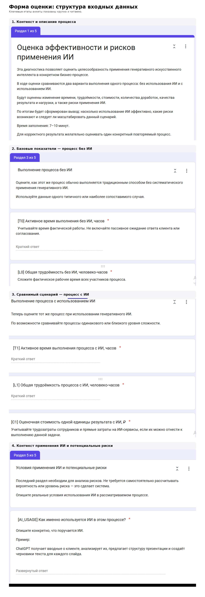
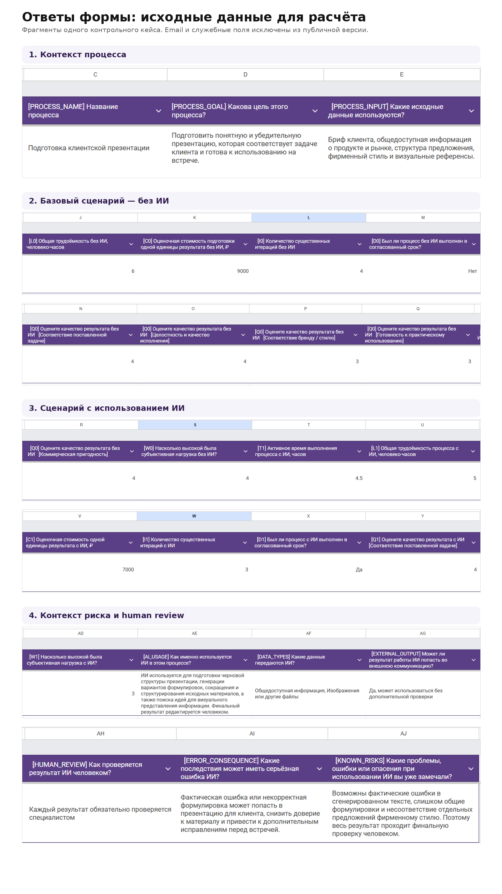
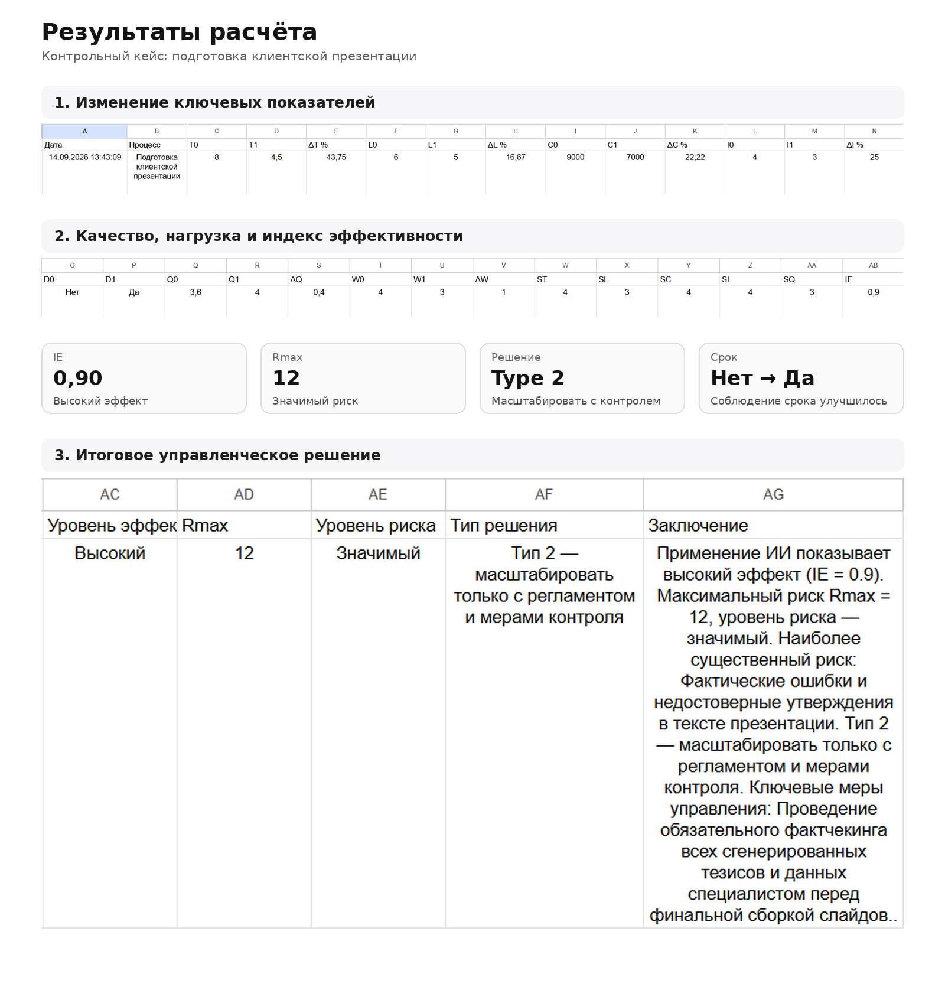
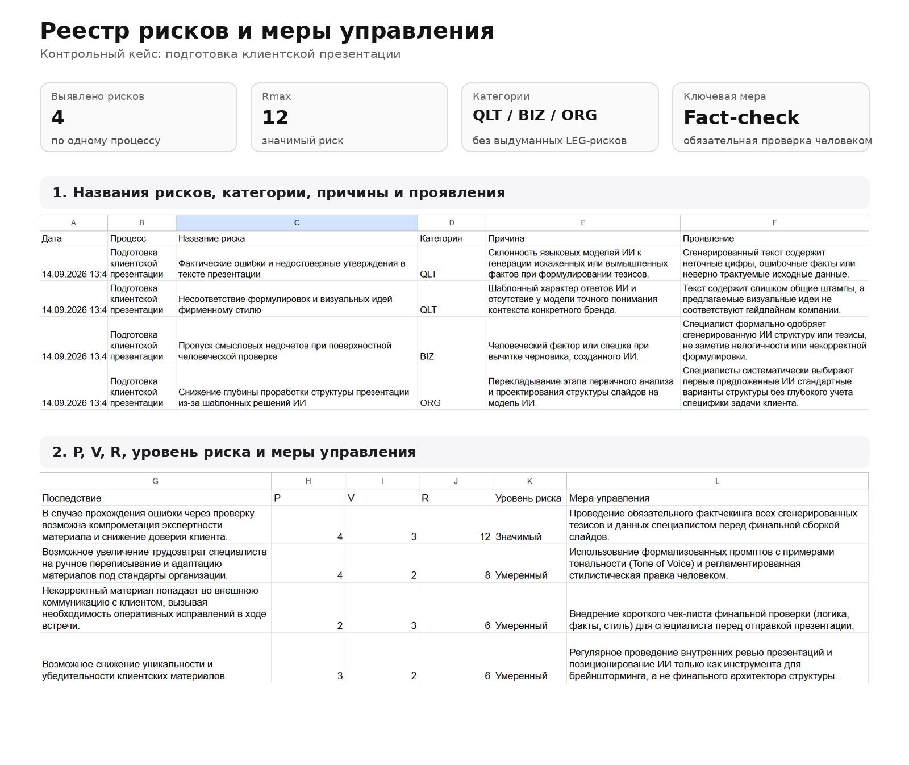

# AI Effect & Risk Agent

AI-агент для оценки эффективности и рисков применения генеративного ИИ в бизнес-процессах.

Проект создан как практическое развитие выпускной квалификационной работы по направлению «Бизнес-информатика» на тему применения генеративного ИИ для автоматизации создания контента и оценки эффективности и рисков.

## О проекте

AI Effect & Risk Agent помогает оценить, действительно ли применение генеративного ИИ улучшает конкретный бизнес-процесс и оправдывает ли полученный эффект возникающие риски.

Система сравнивает один процесс в двух состояниях:

- без использования ИИ;
- с использованием ИИ.

После заполнения анкеты агент автоматически:

1. рассчитывает изменение времени, трудоёмкости, стоимости и числа существенных итераций;
2. оценивает изменение качества результата и субъективной нагрузки;
3. рассчитывает сводный индекс эффективности IE;
4. анализирует контекст применения ИИ с помощью Gemini;
5. выявляет основные риски;
6. классифицирует риски;
7. рассчитывает R = P × V и Rmax;
8. сопоставляет уровень эффекта и риска;
9. формирует управленческое решение;
10. отправляет пользователю итоговый email-отчёт.

## Основная идея

Использование ИИ нельзя оценивать только по скорости выполнения задачи.

Сокращение времени не всегда означает, что:

- снизилась трудоёмкость;
- уменьшилась стоимость;
- сократилось число доработок;
- сохранилось качество;
- снизилась нагрузка на сотрудников;
- отсутствуют новые риски.

Поэтому агент оценивает одновременно эффект и риск применения ИИ в конкретном бизнес-процессе.

## Показатели эффективности

Используются семь показателей:

- T — активное время выполнения;
- L — трудоёмкость;
- C — оценочная стоимость единицы результата;
- I — количество существенных итераций;
- D — соблюдение срока;
- Q — качество результата;
- W — субъективная нагрузка.

Для времени, трудоёмкости, стоимости и итераций рассчитывается относительное изменение:

`ΔX = (X0 - X1) / X0 × 100%`

где:

- X0 — показатель без ИИ;
- X1 — показатель с ИИ.

## Индекс эффективности IE

Для расчёта сводного индекса используются:

- время;
- трудоёмкость;
- стоимость;
- итерации;
- качество.

Формула:

`IE = (ST + SL + SC + SI + SQ) / 20`

Интерпретация:

- `0,80–1,00` — высокий эффект;
- `0,60–0,79` — заметный эффект;
- `0,40–0,59` — умеренный эффект;
- `< 0,40` — слабый или противоречивый эффект.

## Оценка рисков

Риски разделяются на четыре категории:

- `LEG` — юридические и репутационные;
- `ORG` — организационные и кадровые;
- `QLT` — качество результата и ошибки модели;
- `BIZ` — иные существенные бизнес-риски.

Для каждого риска определяются:

- `P` — вероятность возникновения от 1 до 5;
- `V` — влияние от 1 до 5.

Итоговый балл рассчитывается программно:

`R = P × V`

Уровни риска:

- `1–4` — низкий;
- `5–9` — умеренный;
- `10–16` — значимый;
- `17–25` — высокий.

Для итоговой оценки процесса используется максимальный риск `Rmax`.

## Матрица «эффект–риск»

На основании уровня эффективности и риска система формирует одно из четырёх решений:

- **Тип 1** — масштабировать как устойчивый сценарий с базовым контролем;
- **Тип 2** — масштабировать только с регламентом и мерами контроля;
- **Тип 3** — доработать сценарий применения;
- **Тип 4** — не масштабировать в текущем виде.

## Архитектура

Google Form  
↓  
Google Sheets  
↓  
Google Apps Script  
↓  
Расчёт эффективности + Gemini API  
↓  
Расчёт R и Rmax  
↓  
Матрица «эффект–риск»  
↓  
Email-отчёт пользователю

Подробное описание: [`docs/architecture.md`](docs/architecture.md)

## Технологии

- Google Forms
- Google Sheets
- Google Apps Script
- Gemini API
- MailApp

## Ключевые технические решения

### Детерминированные расчёты

LLM не используется для математических расчётов.

Процентные изменения, IE, R, Rmax и итоговый тип решения рассчитываются программно.

### LLM используется для качественного анализа

Gemini применяется для:

- выявления рисков;
- классификации рисков;
- оценки вероятности и влияния;
- формирования мер управления.

### Structured output

Gemini возвращает результат в структурированном JSON-формате, который затем используется Apps Script для дальнейшей программной обработки.

### Контроль галлюцинаций

В prompt зафиксированы ограничения, запрещающие модели без основания:

- придумывать персональные данные;
- придумывать NDA или договорные ограничения;
- считать любой загруженный файл конфиденциальным;
- приписывать компании факты, которых нет во входных данных.

## Демонстрация работы

Ниже показан полный пользовательский сценарий на контрольном кейсе **«Подготовка клиентской презентации»**.

### 1. Пользователь заполняет форму

Форма собирает описание бизнес-процесса, показатели до и после применения ИИ и контекст, необходимый для анализа рисков.

### 2. Исходные данные поступают в систему

После отправки формы ответы автоматически записываются в Google Sheets и используются Apps Script для дальнейшего расчёта.

### 3. Система рассчитывает эффективность

**Без ИИ:**

- активное время: 8 часов;
- трудоёмкость: 6 человеко-часов;
- стоимость: 9000 ₽;
- существенные итерации: 4;
- срок: не соблюдён;
- качество: 3,6 / 5;
- субъективная нагрузка: 4 / 5.

**С ИИ:**

- активное время: 4,5 часа;
- трудоёмкость: 5 человеко-часов;
- стоимость: 7000 ₽;
- существенные итерации: 3;
- срок: соблюдён;
- качество: 4,0 / 5;
- субъективная нагрузка: 3 / 5.

**Изменения:**

- время: −43,75%;
- трудоёмкость: −16,67%;
- стоимость: −22,22%;
- итерации: −25%;
- качество: +0,4;
- субъективная нагрузка: снижение на 1 балл.

Итоговый индекс:

`IE = 0,90`

**Уровень эффекта: высокий.**

### 4. Gemini анализирует риски

В контрольном кейсе система выявила четыре риска применения ИИ.

Максимальный риск:

**Фактические ошибки и недостоверные утверждения в тексте презентации**

- категория: `QLT`;
- вероятность: `P = 4`;
- влияние: `V = 3`;
- итоговый балл: `R = 12`.

`Rmax = 12`

**Уровень риска: значимый.**

В качестве основной меры управления система рекомендует обязательный фактчекинг сгенерированных тезисов и данных специалистом перед финальной сборкой презентации.

### 5. Итоговое управленческое решение

Система независимо оценивает эффект и риск:

- эффект — **высокий**;
- риск — **значимый**.

По матрице «эффект–риск» итоговое решение:

> **Type 2 — масштабировать только с регламентом и мерами контроля.**

Результат показывает, что высокий эффект от применения генеративного ИИ сам по себе не является достаточным основанием для его неконтролируемого масштабирования.

Система не только фиксирует изменение ресурсов и качества, но и показывает, какие риски необходимо контролировать перед масштабированием сценария.

## Ограничения MVP

- часть показателей вводится пользователем вручную;
- P и V являются LLM-assisted оценкой;
- качество и субъективная нагрузка содержат экспертную составляющую;
- система не заменяет экспертную юридическую или отраслевую оценку;
- текущая версия построена на Google Workspace;
- отсутствуют отдельная авторизация и multi-tenant архитектура.

## Возможное развитие

- отдельный web-интерфейс;
- backend API;
- полноценная база данных;
- корпоративная база рисков;
- экспертное подтверждение P и V;
- PDF-отчёты;
- dashboard по процессам компании;
- история изменений эффективности;
- versioning модели и prompt;
- корпоративный RAG;
- multi-tenant архитектура.

## Документация

- [Архитектура](docs/architecture.md)
- [Методология](docs/methodology.md)
- [Case Study](docs/case-study.md)

## Исходный код

Основная логика MVP находится в [`src/Code.gs`](src/Code.gs).
