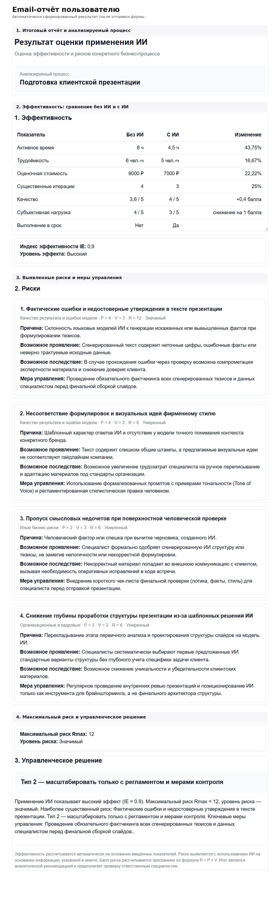

# AI Effect & Risk Agent

**AI-enabled decision-support MVP для оценки эффективности и рисков применения генеративного ИИ в бизнес-процессах.**

Проект вырос из выпускной квалификационной работы по направлению «Бизнес-информатика» и превращает разработанную исследовательскую методику в работающий цифровой инструмент.

## Executive Summary

AI Effect & Risk Agent помогает ответить на практический вопрос: **стоит ли масштабировать применение GenAI в конкретном бизнес-процессе**.

Система сравнивает один процесс без ИИ и с ИИ по времени, трудоёмкости, стоимости, итерациям, срокам, качеству и субъективной нагрузке.

Детерминированные расчёты — процентные изменения, индекс эффективности IE, R, Rmax и итоговый тип решения — выполняются программно.

Gemini используется только там, где требуется интерпретация неструктурированного контекста: для выявления и классификации рисков, оценки P и V и формирования мер управления.

Эффективность и риск оцениваются отдельно, после чего сопоставляются через заранее определённую матрицу управленческих решений.

MVP реализован на Google Forms, Google Sheets, Google Apps Script, Gemini API и MailApp.

Проект демонстрирует полный цикл AI-product development: **исследование проблемы → формализация методики → алгоритм → LLM-интеграция → guardrails → тестирование → работающий MVP**.

---

## Проблема

При внедрении генеративного ИИ бизнес часто оценивает результат слишком упрощённо:

> «Стало быстрее — значит, решение эффективно».

Но сокращение времени ещё не означает, что сценарий действительно готов к масштабированию.

Применение ИИ может одновременно:

- сокращать время;
- почти не менять общую трудоёмкость;
- снижать стоимость;
- требовать дополнительной человеческой проверки;
- влиять на качество результата;
- создавать новые циклы доработок;
- добавлять организационные, юридические или репутационные риски.

Поэтому в основе проекта лежит другой вопрос:

> **Даёт ли ИИ измеримый эффект и оправдывает ли этот эффект возникающие риски?**

---

## Как работает продукт

Пользователь описывает реальный бизнес-процесс и указывает показатели в двух состояниях:

**без ИИ** и **с ИИ**.

Оцениваются:

- `T` — активное время;
- `L` — трудоёмкость;
- `C` — стоимость единицы результата;
- `I` — существенные итерации;
- `D` — соблюдение срока;
- `Q` — качество;
- `W` — субъективная нагрузка.

После отправки формы система автоматически:

1. рассчитывает изменение показателей;
2. определяет индекс эффективности `IE`;
3. передаёт контекст процесса в Gemini;
4. получает структурированный risk analysis;
5. программно рассчитывает `R = P × V`;
6. определяет `Rmax`;
7. сопоставляет эффект и риск;
8. формирует управленческое решение;
9. записывает результаты в risk register;
10. отправляет пользователю итоговый email-отчёт.

Подробная методология: [`docs/methodology.md`](docs/methodology.md)

---

## Ключевое архитектурное решение

Одним из принципиальных решений проекта стало **разделение детерминированной логики и LLM-анализа**.

Я сознательно не передавала языковой модели всю бизнес-логику системы.

### Код отвечает за воспроизводимые расчёты

Google Apps Script рассчитывает:

- процентные изменения;
- среднее качество Q;
- баллы эффективности;
- индекс IE;
- R;
- Rmax;
- уровень риска;
- итоговый тип решения.

Эта часть должна давать одинаковый результат при одинаковых входных данных.

### Gemini отвечает за интерпретацию контекста

LLM анализирует информацию, которую сложно обработать простыми правилами:

- как именно используется ИИ;
- какие данные передаются модели;
- используется ли результат во внешней коммуникации;
- как организована человеческая проверка;
- какие последствия может иметь ошибка;
- какие проблемы уже наблюдал пользователь.

Gemini выявляет риски, классифицирует их и предлагает P, V и меры управления.

Ключевой принцип:

> **LLM интерпретирует неструктурированный контекст, код выполняет формальные расчёты.**

---

## Structured Output и risk pipeline

Ответ Gemini используется не как свободный текст.

Модель возвращает структурированный JSON с данными по каждому риску:

`risk_name`  
`category`  
`reason`  
`manifestation`  
`consequence`  
`probability`  
`impact`  
`mitigation`

После этого Apps Script проверяет значения, рассчитывает итоговый балл риска и формирует risk register.

Так LLM становится частью программного pipeline, а не отдельным текстовым генератором.

---

## Контроль галлюцинаций

Во время тестирования выяснилось, что LLM может достраивать отсутствующий контекст.

Например, при упоминании файлов или изображений модель могла предположить наличие персональных данных, коммерческой тайны или NDA, хотя пользователь этого не сообщал.

Для risk-analysis системы это критично: предположение модели не должно выглядеть как установленный факт.

Поэтому prompt был дополнен guardrails.

Модель должна:

- отделять факты анкеты от предположений;
- не придумывать характеристики компании или клиента;
- не утверждать наличие персональных данных без прямого основания;
- не считать любой файл конфиденциальным;
- не придумывать NDA, штрафы и договорные ограничения;
- формулировать предполагаемые последствия как возможности;
- учитывать human review как фактор снижения риска.

После доработки риск-профиль стал лучше соответствовать фактически описанному сценарию.

---

## Архитектура MVP

Первая версия построена без отдельного backend и DevOps-инфраструктуры:

**Google Forms**  
→ сбор данных

**Google Sheets**  
→ хранение исходных данных, результатов и risk register

**Google Apps Script**  
→ бизнес-логика и расчёты

**Gemini API**  
→ качественный анализ рисков

**MailApp**  
→ автоматическая доставка результата

Полный pipeline:

`Google Form`  
↓  
`Google Sheets`  
↓  
`onFormSubmit`  
↓  
`Google Apps Script`  
↓  
`Efficiency Calculation`  
↓  
`Gemini Risk Analysis`  
↓  
`Structured JSON`  
↓  
`R / Rmax`  
↓  
`Effect–Risk Matrix`  
↓  
`Risk Register`  
↓  
`Email Report`

Подробная архитектура: [`docs/architecture.md`](docs/architecture.md)

---

# Демонстрация работы

Контрольный сценарий — **подготовка клиентской презентации**.

## 1. Ввод данных

Пользователь описывает процесс, показатели до и после применения ИИ и контекст риска.

## 2. Исходные данные

После отправки формы информация автоматически поступает в Google Sheets.

## 3. Расчёт эффективности

В контрольном кейсе:

- активное время: `8 → 4,5 часа`;
- трудоёмкость: `6 → 5 человеко-часов`;
- стоимость: `9000 → 7000 ₽`;
- итерации: `4 → 3`;
- срок: `не соблюдён → соблюдён`;
- качество: `3,6 → 4,0`;
- субъективная нагрузка: `4 → 3`.

Результат:

`IE = 0,90`

**Уровень эффекта — высокий.**

## 4. Анализ рисков

Система выявила четыре риска применения ИИ.

Максимальный:

**Фактические ошибки и недостоверные утверждения в тексте презентации**

`P = 4`  
`V = 3`  
`R = 12`

`Rmax = 12`

**Уровень риска — значимый.**

## 5. Итоговый отчёт

После завершения анализа пользователь автоматически получает email с:

- показателями до и после ИИ;
- IE;
- уровнем эффекта;
- risk register;
- P, V и R;
- мерами управления;
- Rmax;
- итоговой рекомендацией.

## 6. Управленческое решение

Контрольный сценарий дал одновременно:

**IE = 0,90 → высокий эффект**

и

**Rmax = 12 → значимый риск**

По матрице «эффект–риск»:

> **Type 2 — масштабировать только с регламентом и мерами контроля.**

Это один из ключевых результатов проекта.

Система не делает вывод:

> «ИИ ускорил процесс — значит, его нужно внедрять».

Она разделяет два вопроса:

**Даёт ли ИИ измеримый эффект?**  
Да.

**Готов ли сценарий к неконтролируемому масштабированию?**  
Нет — сначала необходимо управлять выявленными рисками.

---

## Моя роль

Проект выполнен мной самостоятельно от исследовательской постановки задачи до работающего MVP.

В рамках проекта я:

- разработала методику оценки эффективности и риска;
- формализовала бизнес-метрики;
- разработала индекс IE и risk model;
- спроектировала матрицу управленческих решений;
- разработала пользовательский сценарий;
- спроектировала структуру формы и данных;
- реализовала бизнес-логику в Google Apps Script;
- интегрировала Gemini API;
- настроила structured output;
- разработала prompt и guardrails;
- автоматизировала risk register;
- автоматизировала email-reporting;
- протестировала и итерационно доработала систему.

---

## Ограничения MVP

Текущая версия является **decision-support system**, а не полностью автономной системой принятия решений.

Основные ограничения:

- часть исходных данных вводится пользователем вручную;
- качество и субъективная нагрузка содержат экспертную составляющую;
- P и V являются LLM-assisted оценкой;
- risk scoring пока не использует статистическую историю инцидентов компании;
- Google Sheets выступает базой данных MVP;
- отсутствуют отдельная авторизация и multi-tenant архитектура.

---

## Возможное развитие

Для production-версии:

- отдельный web-интерфейс;
- backend API и полноценная база данных;
- authentication / authorization;
- multi-tenant архитектура;
- корпоративный справочник рисков;
- экспертная верификация P и V;
- использование статистики компании для risk scoring;
- dashboard по AI-процессам;
- versioning prompt и модели;
- audit log;
- PDF-отчёты;
- интеграции с корпоративными системами и RAG.

---

## Что демонстрирует проект

AI Effect & Risk Agent показывает переход от исследовательской гипотезы к работающему AI-продукту:

**исследование проблемы**  
→ **формализация методики**  
→ **алгоритм**  
→ **продуктовый сценарий**  
→ **LLM API**  
→ **structured output**  
→ **guardrails**  
→ **тестирование**  
→ **workflow automation**  
→ **MVP**

Конечный результат — система, которая получает данные о реальном бизнес-процессе и автоматически формирует воспроизводимое управленческое решение.

---

## Документация

- [Architecture](docs/architecture.md)
- [Methodology](docs/methodology.md)
- [Case Study](docs/case-study.md)

## Source Code

Основная логика MVP: [`src/Code.gs`](src/Code.gs)
